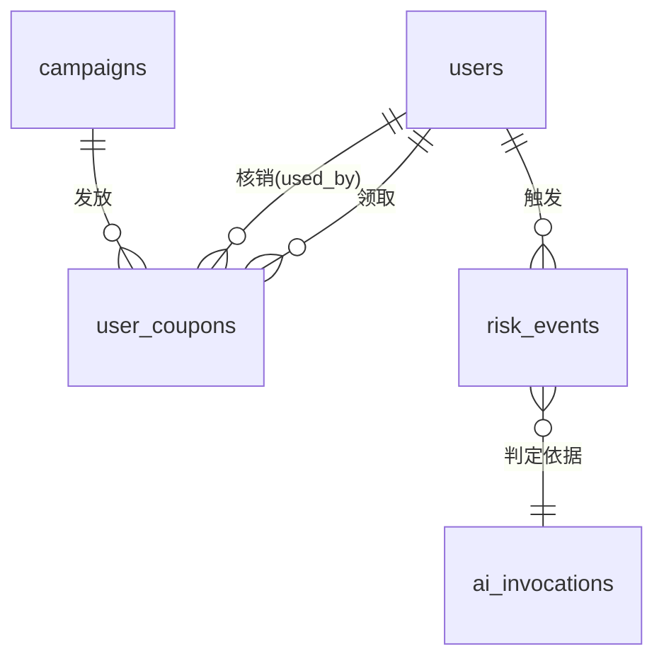

# 数据库设计 — 优惠券发放与核销中心

目标库：PostgreSQL 16（CON-004）。全部时间字段为 `timestamptz`，存 UTC，展示层转本地时区（NFR-005）。

## 一、实体关系



五张表，无更多。刻意不建的表：券池表（ADR-001 计数器模型）、幂等键表（ADR-004 券码即幂等键）、统计汇总表（ADR-008 实时聚合）、作废记录表（无作废功能）。

## 二、表定义

### users（FR-060、FR-062）

| 字段 | 类型 | 约束 | 说明 |
|---|---|---|---|
| id | bigserial | PK | |
| username | varchar(64) | NOT NULL, UNIQUE | 登录标识 |
| display_name | varchar(64) | NOT NULL | |
| role | varchar(16) | NOT NULL, CHECK in (OPERATOR, USER, VERIFIER, ADMIN) | 角色由此单一来源决定 |
| risk_blocked | boolean | NOT NULL DEFAULT false | 存在未解除的风险标记时为 true（ADR-007） |
| created_at | timestamptz | NOT NULL DEFAULT now() | |

`role` 用 CHECK 约束而非外键表：四个角色是需求固定的枚举，不存在运营期新增角色的需求，独立角色表只会增加联表成本。

`risk_blocked` 是 `risk_events` 的派生便利字段，用于领券路径上的单次快速判断，避免每次领券都聚合 `risk_events`。它与 `risk_events` 的一致性由 `services/risk` 在同一事务内维护。

### campaigns（FR-001、FR-002、FR-003）

| 字段 | 类型 | 约束 | 说明 |
|---|---|---|---|
| id | bigserial | PK | |
| name | varchar(128) | NOT NULL | |
| category | varchar(32) | NOT NULL, CHECK in (FOOD, TRAVEL, SHOPPING, LIFE) | AI 生成推荐理由的语义来源（D-07） |
| face_value | numeric(10,2) | NOT NULL, CHECK > 0 | 面额。仅展示与推荐特征，不参与结算（CON-003） |
| total_stock | integer | NOT NULL, CHECK > 0 | |
| claimed_count | integer | NOT NULL DEFAULT 0, CHECK >= 0 | **单调递增，永不回退（INV-1）** |
| start_at | timestamptz | NOT NULL | |
| end_at | timestamptz | NOT NULL | |
| validity_minutes | integer | NOT NULL, CHECK >= 1 | 领取后有效时长，分钟（ADR-003） |
| per_user_limit | integer | NOT NULL DEFAULT 1, CHECK >= 1 | |
| created_by | bigint | FK users(id) | |
| created_at / updated_at | timestamptz | NOT NULL DEFAULT now() | |

表级约束：`CHECK (end_at > start_at)`、`CHECK (claimed_count <= total_stock)`。

第二条 CHECK 是 INV-1 的**数据库级兜底**：即使应用层写错，超发也会被数据库直接拒绝。这是把不变量从"约定"变成"强制"的关键一行。

**不存字段**：`status`（活动状态由 `start_at`/`end_at` 与 `now()` 派生，ADR-002）、`remaining_stock`（= `total_stock - claimed_count`，恒等式）。

索引：`(start_at, end_at)` 支持"进行中活动"查询；`(category)` 支持推荐召回。

### user_coupons（FR-010、FR-011、FR-014、FR-020）

| 字段 | 类型 | 约束 | 说明 |
|---|---|---|---|
| id | bigserial | PK | |
| campaign_id | bigint | NOT NULL, FK campaigns(id) | |
| user_id | bigint | NOT NULL, FK users(id) | 持有人 |
| seq | integer | NOT NULL, CHECK >= 1 | 该用户在本活动的第几张 |
| code | varchar(16) | NOT NULL, UNIQUE | 10 位 Crockford Base32（ADR-010） |
| status | varchar(8) | NOT NULL DEFAULT 'UNUSED', CHECK in (UNUSED, USED) | **仅两态（INV-3）** |
| claimed_at | timestamptz | NOT NULL DEFAULT now() | |
| expires_at | timestamptz | NOT NULL | `min(campaign.end_at, claimed_at + validity_minutes)`，落库（ADR-003） |
| used_at | timestamptz | NULL | 核销时间，审计 |
| used_by | bigint | NULL, FK users(id) | 核销人，审计（NFR-008） |

**关键约束 `UNIQUE (campaign_id, user_id, seq)`**：这一行索引就是"每用户限领数"的并发保障（ADR-001）。并发下两个请求算出同一个 `seq`，数据库拒绝其中一个，触发回滚，`claimed_count` 的 `+1` 随之撤销。

表级约束：`CHECK (status='USED' AND used_at IS NOT NULL AND used_by IS NOT NULL) OR (status='UNUSED' AND used_at IS NULL AND used_by IS NULL)` —— 使核销的三个字段无法出现不一致状态。

索引：
- `UNIQUE (code)`：核销的唯一入口是券码，此索引承载核销全部查询
- `(campaign_id, status)`：统计聚合（ADR-008）
- `(user_id, claimed_at DESC)`：我的券列表、推荐的用户历史特征
- `(user_id, claimed_at)`：风控窗口计数

**不存字段**：`is_expired`（惰性判断，ADR-002）。

### risk_events（FR-050、FR-052）

| 字段 | 类型 | 约束 | 说明 |
|---|---|---|---|
| id | bigserial | PK | |
| user_id | bigint | NOT NULL, FK users(id) | |
| campaign_id | bigint | NULL, FK campaigns(id) | 触发时的目标活动 |
| window_request_count | integer | NOT NULL | 窗口内请求数，判定依据 |
| risk_score | integer | NULL, CHECK 0~100 | 规则层直接拦截时可为空 |
| decision | varchar(16) | NOT NULL, CHECK in (PASS, BLOCK, MANUAL_REVIEW) | 三态（FR-050） |
| decided_by | varchar(8) | NOT NULL, CHECK in (RULE, AI) | 判定来源，区分是否降级 |
| degraded | boolean | NOT NULL DEFAULT false | |
| ai_invocation_id | bigint | NULL, FK ai_invocations(id) | 追溯 AI 判定理由（NFR-008） |
| status | varchar(16) | NOT NULL DEFAULT 'PENDING', CHECK in (PENDING, RELEASED, KEPT) | 运营处置状态 |
| handled_by | bigint | NULL, FK users(id) | |
| handled_at | timestamptz | NULL | |
| created_at | timestamptz | NOT NULL DEFAULT now() | |

只有 `decision` 为 `BLOCK` 或 `MANUAL_REVIEW` 时落行；`PASS` 不落行，避免正常流量把表打满。`PASS` 枚举值保留是为了 AI 返回值的完整表达。

索引：`(created_at DESC)` 支持近 24h 拦截计数；`(status)` 支持待处理标记计数；`(user_id, created_at DESC)`。

### ai_invocations（FR-053）

| 字段 | 类型 | 约束 | 说明 |
|---|---|---|---|
| id | bigserial | PK | |
| purpose | varchar(16) | NOT NULL, CHECK in (RECOMMEND, RISK) | |
| model_id | varchar(128) | NOT NULL | |
| prompt_version | varchar(16) | NOT NULL | 与特征快照共同重建 prompt |
| input_features | jsonb | NOT NULL | 输入特征快照，**不含完整 prompt** |
| raw_output | text | NULL | AI 原始返回，失败时为空 |
| parsed_result | jsonb | NULL | 校验通过后的结构化结果 |
| latency_ms | integer | NOT NULL | |
| degraded | boolean | NOT NULL DEFAULT false | |
| degrade_reason | varchar(64) | NULL | timeout / invalid_json / not_configured / http_error / schema_invalid / id_not_in_whitelist / score_out_of_range |
| user_id | bigint | NULL, FK users(id) | |
| created_at | timestamptz | NOT NULL DEFAULT now() | |

**禁止写入凭证任何片段**（NFR-004）。`degraded=true` 时 `degrade_reason` 必须非空，以 CHECK 强制。

索引：`(purpose, created_at DESC)`。

## 三、统一统计口径 SQL（ADR-008、INV-1、INV-2）

单活动指标，唯一权威写法：

```sql
SELECT c.total_stock,
       c.claimed_count,
       c.total_stock - c.claimed_count                                       AS remaining_stock,
       count(uc.id) FILTER (WHERE uc.status = 'USED')                        AS used_count,
       count(uc.id) FILTER (WHERE uc.status = 'UNUSED'
                              AND uc.expires_at >  now())                    AS active_count,
       count(uc.id) FILTER (WHERE uc.status = 'UNUSED'
                              AND uc.expires_at <= now())                    AS expired_count,
       c.claimed_count::numeric / c.total_stock                              AS claim_rate,
       CASE WHEN c.claimed_count = 0 THEN NULL
            ELSE count(uc.id) FILTER (WHERE uc.status='USED')::numeric
                 / c.claimed_count END                                      AS redeem_rate
  FROM campaigns c
  LEFT JOIN user_coupons uc ON uc.campaign_id = c.id
 WHERE c.id = :cid
 GROUP BY c.id;
```

口径固定点：

- `claim_rate` 分母为 `total_stock`（系统无曝光埋点，CON-005）
- `redeem_rate` 分母为 `claimed_count`；`claimed_count = 0` 时为 NULL，前端显示「—」，避免除零（FR-030 AC-5）
- `expired_count` 由 `expires_at` 实时比较得出，无需任何后台任务（ADR-002）

对账断言，任意时刻必须成立，作为验证 SQL 保留：

```sql
-- INV-1
SELECT count(*) FROM campaigns WHERE claimed_count > total_stock;                      -- 必须为 0
-- INV-2
SELECT c.id FROM campaigns c
  LEFT JOIN user_coupons uc ON uc.campaign_id = c.id
 GROUP BY c.id, c.claimed_count HAVING count(uc.id) <> c.claimed_count;                -- 必须为空
```

第二条同时验证了"每次 `claimed_count` 递增都恰好对应一张券"，即领券事务不存在半途提交。

异常监控指标（FR-031）：

```sql
SELECT count(*) FROM risk_events
 WHERE decision IN ('BLOCK','MANUAL_REVIEW') AND created_at >= now() - interval '24 hours';
SELECT count(*) FROM risk_events WHERE status = 'PENDING';
```

风控窗口计数（FR-050 规则层）：

```sql
SELECT count(*) FROM user_coupons
 WHERE user_id = :uid AND claimed_at >= now() - (:window_seconds * interval '1 second');
```

口径说明：规则层统计的是**成功领取记录**。被拦截的请求不落 `user_coupons`，因此高频攻击在首次拦截后计数不再增长；这不影响 SC-006，因为拦截状态由 `users.risk_blocked` 与 `risk_events` 持续生效，且窗口内的成功记录已足以维持判定。实现阶段需在 `services/risk` 中同时计入窗口内的 `risk_events`，使连续被拦截的请求仍被判为高风险。

## 四、迁移策略

Alembic 单条初始迁移 `0001_init` 建全部五表、约束与索引。后续变更一律新增 revision，不修改历史迁移。启动时执行 `alembic upgrade head`，幂等。

seed（FR-062）独立于迁移，以 `INSERT ... ON CONFLICT (username) DO NOTHING` 实现幂等：四类角色具名账号（`op001`、`user_a`/`user_b`/`user_c`、`verifier001`、`admin001`）+ 批量 `user001` ~ `userNNN`（默认 200，可配）。

## 五、数据保留

演示项目，不做归档与清理。`ai_invocations` 的增长由"不存完整 prompt"控制；`risk_events` 的增长由"仅落 BLOCK/MANUAL_REVIEW"控制。


---

# 六、运营增强 v2 数据设计（CR-002）

> 本节取代前文“五张表，无更多”的历史范围描述。实际产品化改造已有 `stores` 等增量表；本次继续用新增 Alembic revision 扩展。

## 6.1 campaigns 增量字段

| 字段 | 类型 | 约束/默认 | 说明 |
|---|---|---|---|
| manual_state | varchar(16) | NOT NULL DEFAULT RUNNING；CHECK | RUNNING/PAUSED/TERMINATED |
| terminated_at | timestamptz | NULL | 提前结束时间；TERMINATED 时非空 |
| terminated_by | bigint | NULL FK users | 提前结束操作人 |
| daily_limit | integer | NULL CHECK > 0 | NULL 表示无限每日额度 |
| audience_mode | varchar(16) | NOT NULL DEFAULT GLOBAL | GLOBAL/OVERRIDE，预留一致继承语义 |
| risk_policy_mode | varchar(16) | NOT NULL DEFAULT INHERIT | INHERIT/OVERRIDE |
| risk_policy_id | bigint | NULL FK risk_policies | OVERRIDE 时必填 |

人工状态约束：`TERMINATED` 必须有 `terminated_at/terminated_by`；其他状态两字段为空。禁止 TERMINATED 回到其他状态由服务层状态机强制并写审计。

## 6.2 campaign_audiences

| 字段 | 类型 | 约束 |
|---|---|---|
| campaign_id | bigint FK campaigns | PK 组成 |
| segment_code | varchar(32) | PK 组成；CHECK in ALL/NEW/ACTIVE/DORMANT/HIGH_REDEEM/LOW_REDEEM |

同一活动多个行采用 OR。`ALL` 不得与其他 segment 同时保存，由服务层校验。

## 6.3 campaign_time_windows

| 字段 | 类型 | 约束 |
|---|---|---|
| id | bigserial | PK |
| campaign_id | bigint FK campaigns | NOT NULL |
| start_minute | smallint | 0~1439 |
| end_minute | smallint | 1~1440，且 end > start |

以北京时间一天内分钟数保存，不携带日期或时区。服务层拒绝同活动重叠区间。无记录表示全天可领。

## 6.4 campaign_daily_counters

| 字段 | 类型 | 约束 |
|---|---|---|
| campaign_id | bigint FK campaigns | PK 组成 |
| business_date | date | PK 组成；Asia/Shanghai 日期 |
| claimed_count | integer | NOT NULL DEFAULT 0 CHECK >=0 |
| updated_at | timestamptz | NOT NULL |

原子占额：先 `INSERT ... ON CONFLICT DO NOTHING`，再执行：

```sql
UPDATE campaign_daily_counters d
   SET claimed_count = claimed_count + 1, updated_at = :as_of
  FROM campaigns c
 WHERE d.campaign_id = c.id
   AND d.campaign_id = :cid
   AND d.business_date = :business_date
   AND (c.daily_limit IS NULL OR d.claimed_count < c.daily_limit)
   AND c.manual_state = 'RUNNING';
```

`rowcount=0` 表示每日额度耗尽或状态改变；该 UPDATE 与总库存扣减、券 INSERT 同事务，后续失败自动回滚日计数。

## 6.5 operator_settings

单例行 `id=1`，字段：`audience_thresholds jsonb`、`default_risk_policy_id`、`alert_settings jsonb`、`updated_by`、`updated_at`。JSON 必须经 Pydantic schema 校验后落库；数据库只做非空与 JSON 类型兜底。

默认 audience_thresholds：新用户 7 天、活跃 7 天、沉睡 30 天、核销样本 3、高核销 60%、低核销 20%。

## 6.6 risk_policies

| 字段 | 类型 | 说明 |
|---|---|---|
| id | bigserial PK | |
| name / level | varchar | LOW/MEDIUM/HIGH/CUSTOM |
| is_global_default | boolean | 至多一条 true |
| hard_rules | jsonb | 窗口秒数、频率硬阈值等 |
| factor_weights | jsonb | 六类因素分值配置 |
| review_threshold | integer | 0~99 |
| block_threshold | integer | 1~100 且大于 review_threshold |
| version | integer | 每次修改递增 |
| created_by / updated_by / timestamps | 审计 | |

活动继承时风险事件仍保存当次完整 `policy_snapshot`，确保事后可复算，不依赖当前全局值。

## 6.7 risk_events 增量与 risk_restrictions

`risk_events` 新增：

- `factor_breakdown jsonb NOT NULL DEFAULT '{}'`
- `evidence_snapshot jsonb NOT NULL DEFAULT '{}'`
- `policy_snapshot jsonb NOT NULL DEFAULT '{}'`
- `explanation_source varchar(16)`：AI/TEMPLATE
- `recommended_action text`
- `handling_status varchar(20)`：AUTO_BLOCKED/PENDING/RELEASED/RESTRICTED
- `restricted_until timestamptz NULL`

旧 `status` 字段迁移映射后进入兼容期，API 改用 `handling_status`。BLOCK 默认 AUTO_BLOCKED；MANUAL_REVIEW 默认 PENDING。

`risk_restrictions`：`(user_id,campaign_id)` UNIQUE，含 `source_event_id`、`restricted_until`（NULL=永久）、`released_at/by`、`created_at/by`。查询有效限制条件为未释放且 (`restricted_until IS NULL OR restricted_until > :as_of`)。

## 6.8 config_change_logs

| 字段 | 类型 | 说明 |
|---|---|---|
| id | bigserial PK | |
| object_type | varchar(32) | CAMPAIGN/OPERATOR_SETTINGS/RISK_POLICY/ALERT_SETTINGS |
| object_id | varchar(64) | 支持单例和数值 ID |
| action | varchar(32) | CREATE/UPDATE/PAUSE/RESUME/TERMINATE |
| before_data / after_data | jsonb | 差异前后快照 |
| changed_by | bigint FK users | OP |
| created_at | timestamptz | |

只提供查询，不提供删除/更新 API。配置修改与日志 INSERT 同事务。

## 6.9 指标查询索引

新增索引：`user_coupons(claimed_at,campaign_id)`、`user_coupons(used_at,campaign_id) WHERE used_at IS NOT NULL`、`risk_events(created_at,campaign_id,decision)`、`risk_events(handling_status,created_at)`、`config_change_logs(object_type,object_id,created_at DESC)`。活动级实时数据规模为演示级，继续禁止预聚合表。

## 6.10 迁移与兼容

新增 revision（建议 `0003_operator_enhancements`）按“先建新表 → 加可空/带默认字段 → 回填 → 加约束/索引”执行。历史活动回填 ALL 人群、RUNNING、无限每日额度、全天、INHERIT。现有 risk_blocked 用户按其未处理事件迁移为对应活动限制；无法确定活动的旧记录不应扩散成全局限制，保留审计但不阻断所有活动。
