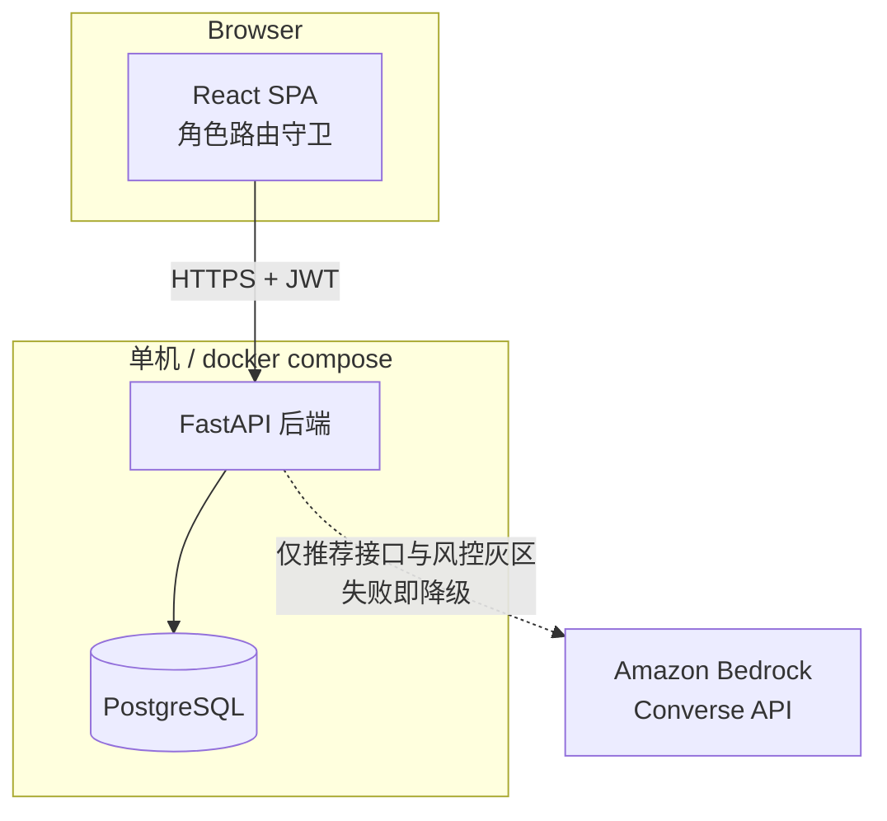
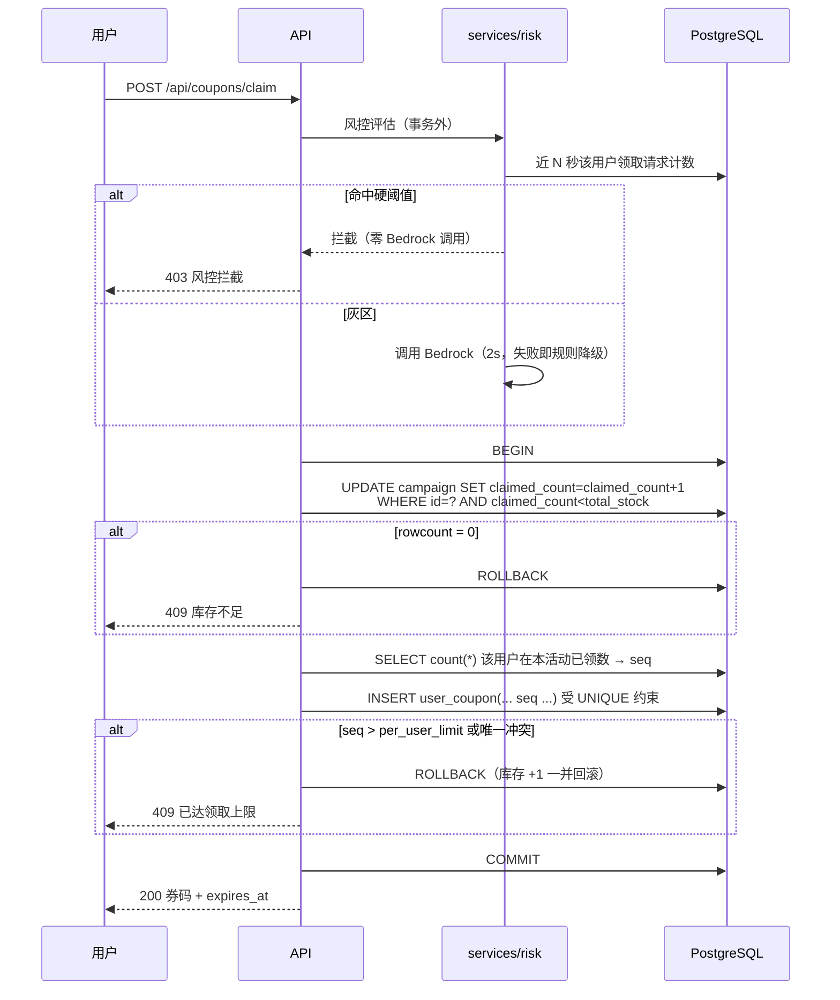
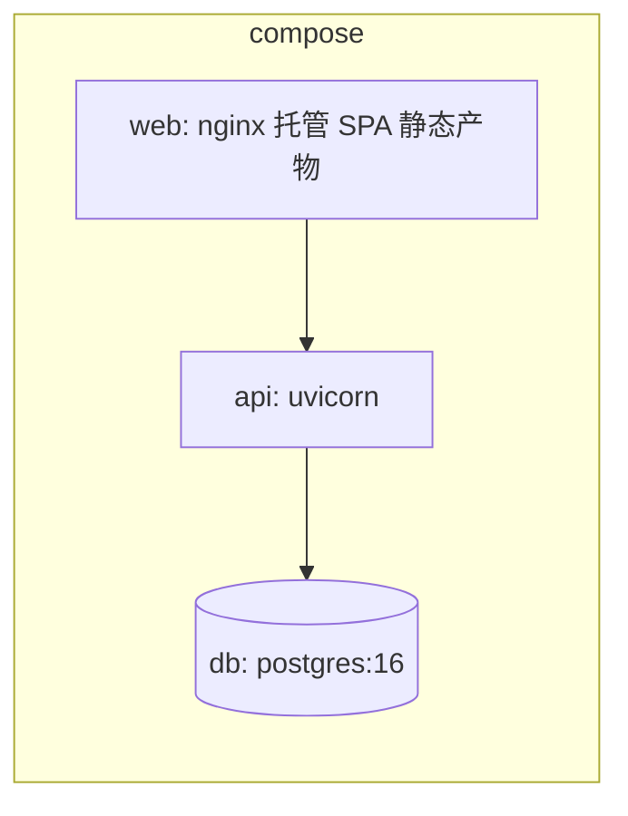

# 系统架构设计 — 优惠券发放与核销中心

需求基线：`../requirements/`；决策记录：`../plan/design-plan.md`（ADR-001 ~ ADR-010）。

## 一、架构总览

单体后端 + 单页前端 + 单实例 PostgreSQL，单机部署（CON-001）。外部依赖仅 Amazon Bedrock，且**不可用时系统功能不缺失，仅降级**（NFR-003）。



关键结构性事实：Bedrock 的连线是**虚线**，代表可断。领券与核销这两条交易链路上不存在指向 Bedrock 的实线（ADR-005）。

## 二、领域与模块划分

按业务能力切分，模块间只允许单向依赖，方向为 `routers → services → models/db`，`services` 内部禁止反向依赖 `routers`。

| 模块 | 职责 | 不负责 |
|---|---|---|
| `routers/` | HTTP 契约：入参校验、角色声明、错误码映射 | 业务规则、事务边界 |
| `services/campaign` | 活动创建与编辑规则（库存只增、字段可变性） | 券的生命周期 |
| `services/claim` | 领券事务：扣库存、算 seq、生成券码、计算 `expires_at` | 风控判定、推荐 |
| `services/redeem` | 核销状态机与原因判定优先级 | 券的发放 |
| `services/risk` | 两层漏斗、风险标记生命周期 | AI 传输细节 |
| `services/recommend` | 确定性召回、白名单校验、降级排序 | AI 传输细节 |
| `services/bedrock` | Converse 调用、超时重试、输出校验、留痕 | 任何业务语义 |
| `services/stats` | 统计口径 SQL 与对账恒等式 | 数据写入 |
| `security/` | JWT 签发校验、角色依赖 | 用户数据管理 |

`services/bedrock` 是唯一接触外部网络的模块，也是唯一持有凭证的模块。这条边界让 NFR-004（凭证不外泄）可以在单点审查。

## 三、并发与事务边界

### 领券（FR-010）

事务边界严格限定在下述第 3~7 步。风控在事务**之外**先行，因为它可能调用外部网络，绝不能把网络延迟包进持有 `campaign` 行锁的事务里（ADR-001、ADR-005）。



不变量保障点：

- **INV-1**：`claimed_count` 只在条件 UPDATE 中递增，且条件保证不越过 `total_stock`；任何后续失败都通过 ROLLBACK 撤销该递增，不存在"库存被扣但券没发"的中间态。
- **限领与库存的一致性**：唯一约束冲突发生在同一事务内，因此库存回滚是自动的，不需要补偿逻辑。

### 核销（FR-020）

无显式事务需求，单条 UPDATE 即是原子操作：

```sql
UPDATE user_coupon
   SET status='USED', used_at=now(), used_by=:operator
 WHERE code=:code AND status='UNUSED' AND expires_at > now();
```

`rowcount=1` 成功；`rowcount=0` 时回查该券，判定顺序**固定为 status 优先、时间其次**（ADR-004）：

| 回查结果 | 返回 |
|---|---|
| `status='USED'` | 已核销（即使此刻也已过期） |
| `status='UNUSED'` 且 `expires_at <= now()` | 券已过期 |
| 无记录 | 券不存在 |

并发 N 次核销同一券码时，条件 UPDATE 使恰好一次 `rowcount=1`，其余全部落入回查分支并返回"已核销"，`used_at` / `used_by` 只被写入一次（NFR-002）。

## 四、AI 集成与降级路径

### 统一封装

`services/bedrock` 对外暴露单一入口，参数含用途（推荐/风控）、prompt、超时、重试次数。内部固定顺序：构造 Converse 请求 → 调用 → 解析 → **严格校验** → 写 `ai_invocation` → 返回或抛出降级信号。

校验不通过的判定项（ADR-009）：非 2xx、超时、非法 JSON、必填字段缺失、活动 ID 不在本次候选白名单内、评分不是 0~100 整数。任一命中即视为不可用。

### 降级矩阵

| 功能 | 正常路径 | 降级路径 | 保障的验收 |
|---|---|---|---|
| 推荐 FR-040 | 确定性召回 → AI 重排与理由 → 白名单过滤 | 热度（领取率）排序 + 模板理由，`degraded=true` | 列表非空是**硬保证**，不依赖 AI 可用性 |
| 风控 FR-050 | 规则层 → 灰区调 AI → 评分 + 决策 | 规则层保守判定：接近硬阈值判人工审核，否则放行 | 高频拦截能力与 AI 无关 |

超时预算：推荐 3s ×（1+1 次重试）；风控 2s、不重试。风控更严的原因是它位于领券这条交易链路上。

**断网等价于降级模式**：缺少 `AWS_BEARER_TOKEN_BEDROCK` 时服务正常启动，全部 AI 入口直接走降级，SC-009 由此成立。

## 五、安全边界

| 边界 | 措施 | 关联 |
|---|---|---|
| 认证 | JWT（HS256），载荷 `sub`/`role`/`exp`；无 token → 401 | FR-060 |
| 授权 | 后端每个路由声明允许角色，越权 → 403 且响应体不含目标资源字段 | FR-061、SC-008 |
| 数据隔离 | "我的券"查询强制以 token 中的 `sub` 为过滤条件，不接受客户端传入的 user_id | FR-011 |
| 券码 | 10 位 Crockford Base32，密码学随机；核销仅凭券码，故券码不可预测是安全前提 | ADR-010 |
| 凭证 | 仅从环境变量读取；`services/bedrock` 是唯一持有点；禁止写入日志、响应、`ai_invocation` | NFR-004 |
| 密钥 | `jwt_secret` 由环境变量注入，代码内默认值仅供本地开发并需在 `.env.example` 中明示 | NFR-004 |

配置边界：全部可变参数（数据库连接、JWT、风控三阈值、Bedrock region/modelId/超时/重试、seed 用户数）集中于单一 Settings 对象，从环境变量与 `.env` 加载。风控阈值可配是 FR-050 AC-4 的实现前提（演示现场可调而不改代码）。

## 六、部署拓扑



启动序列：`db` 健康检查通过 → `api` 执行 `alembic upgrade head` → `api` 执行幂等 seed（FR-062）→ 开始服务。迁移与 seed 均幂等，重复启动不产生重复数据。

缺少 AI 凭证时启动流程不受影响（FR-071 AC-2）。

## 七、可观测性与审计

| 记录对象 | 位置 | 用途 |
|---|---|---|
| 每次 AI 调用与每次降级 | `ai_invocation` | 运营审核风险标记的判定依据；无此表则 FR-052 无法运转 |
| 风控决策 | `risk_event` | 拦截计数、待处理标记、审核处置留痕 |
| 核销动作 | `user_coupon.used_at` / `used_by` | 核销责任可追溯 |

`ai_invocation` 不存完整 prompt，只存 prompt 版本号 + 输入特征快照，二者可完整重建 prompt，同时避免表膨胀与凭证混入风险。

留痕写入失败不得阻断主业务，但需记录告警日志。

## 八、错误处理约定

| 类别 | HTTP | 语义 |
|---|---|---|
| 入参非法 | 400 | 字段级说明 |
| 未认证 / token 失效 | 401 | 不区分原因 |
| 越权 / 风控拦截 / 待人工审核 | 403 | 越权不泄露资源存在性；风控两态文案不同 |
| 资源不存在 | 404 | 券不存在、活动不存在 |
| 业务状态冲突 | 409 | 库存不足、已达领取上限、已核销、券已过期、活动未开始或已结束 |
| 服务端异常 | 500 | 不含堆栈与凭证 |

AI 故障**不产生独立错误码**：一律转为降级并在响应中以 `degraded` 标识，用户不感知 AI 错误（FR-041、FR-051）。
